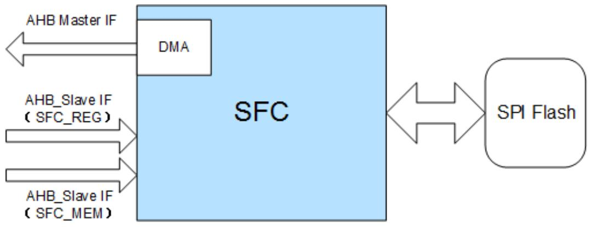
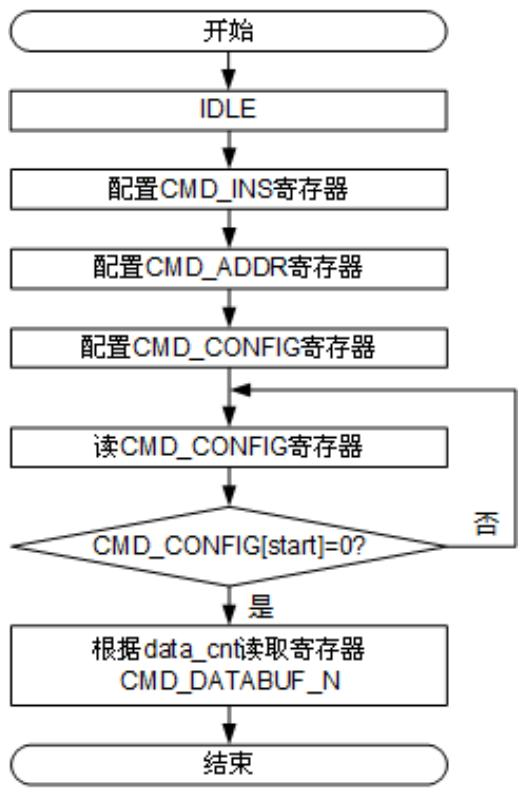
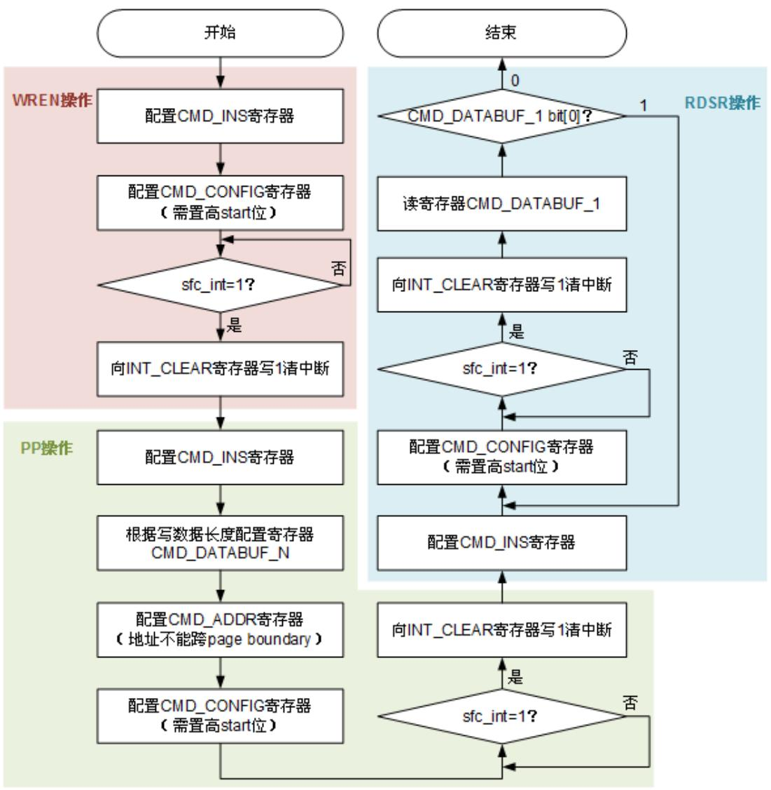
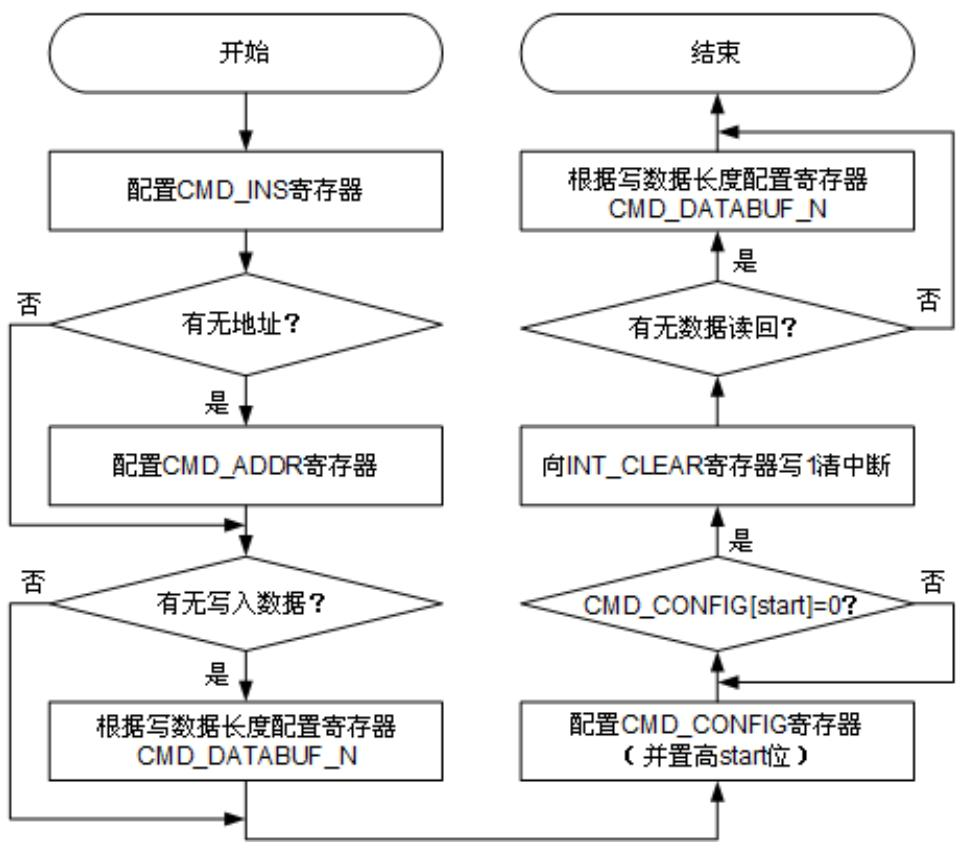

(ch3-qspi)=

# 3 QSPI Flash 控制器

3.1 概述 

3.2 功能描述 

3.3 工作方式 

3.4 寄存器概览 

3.5 寄存器描述 

## 3.1 概述

SFC 是一个 SPI Flash 控制器。业务侧提供一个 AHB（Advanced High Performance Bus） Slave 接口，主要完成 AHB 通道对 SPI Flash 的访问控制功能；提供一个 AHB Master 接口，用于 DMA 方式读写 Flash。 


图3-1 SFC 应用框图





注：IF（Interface）。 

## 3.2 功能描述

### AHB Slave 接口

AHB Slave 接口具有以下特点： 

 提供一个 AHB Slave 接口，可以根据不同的选择信号访问内部配置寄存器或直接 访问 SPI Flash Memory。 

支持 AMBA2.0 协议。 

仅支持小端（Little-Endian）。 

#### AHB Master 接口

AHB Master 接口具有以下特点： 

 提供一个 AHB Master 接口，用于 DMA 方式在内存和 Flash 之间搬运数据。 

支持 AMBA2.0 协议。 

只支持小端。 

支持 Single、INCR、INCR4、INCR8、INCR16 传输类型。 

不支持 Early Termination。 

支持总线 Lock 传输。 

### 存储器接口

存储器接口具有以下特点： 

片选的存储空间最大支持到 64Mbit（3Byte 地址模式）。片选映射基地址可配置。 只支持片选 1，不支持片选 0。 

支持 Standard SPI、Dual-Output/Dual-Input SPI、Quad-Output/Quad-Input SPI、Dual-I/O SPI、Quad-I/O SPI 五种接口类型。上电后默认支持 Standard SPI 接口类型，可通过寄存器配置切换接口类型。 

支持 XIP（Executed In Place）。 

SPI Flash 读写操作支持总线直接读写、寄存器编程读写、DMA 读写三种方式。 

支持多种写保护操作。 

SFC 模块支持 SPI Mode0 和 Mode3，按协议要求，支持 SPI Mode0 和 Mode3 的 SPI Flash 器件在时钟的上升沿采样数据，在时钟的下降沿输出数据。 

XIP 实现地址 remap，为了软件只编译一个 XIP 镜像，升级镜像时主镜像和备份 镜像使用相同地址。 

### Flash 数据在线解密

Flash 数据在线解密具有以下特点： 

解密算法为 AES-128-CTR，仅支持 1 个 IV，秘钥来源于 KM 派生。 

支持 4 个解密区域，配置粒度为 256Byte；每个区域支持单独的 IV 解密起始地址 可配，配置粒度同为 256Byte，4 个解密区域配置不能存在交叉地址。 

### 说明

支持 AES 在线解密，解密时读取数据量没有 16Byte 的倍数与对齐的约束。 

## 3.3 工作方式

### 3.3.1 读写 Flash

有三种方式读写 Flash： 

通过寄存器配置方式发送 SPI Flash Program、Read 等命令来读写 Flash。例 如：对寄存器 CMD_CONFIG 写 0x0000_7F8B，对寄存器 CMD_INS 写 0x03， 表示通过 Standard SPI 方式发起读 64Byte Flash 数据的操作。 

此方式直接控制需要发送的 Flash 命令。 

 通过 AHB Slave 接口以类似读写普通 Memory 的方式读写 Flash。 SFC 模块会自动将 AHB 总线的读写操作时序映射为 SPI Flash 读写命令。 

通过 DMA 方式在 Flash 和外部 Memory 之间搬移数据。 

### 3.3.2 其他操作

对 Flash 的其他操作如 Erase、进入 Deep Power Down、读 Device ID 等必须通过寄 存器访问来实现。需要配置 CMD_INS[REG_INS]为相应的命令，具体请参见 Flash 器 件手册。 

例如：对寄存器 CMD_CONFIG 写 0x0000_0583，对寄存器 CMD_INS 写 0x0000_009F，表示读器件 ID 的操作。 

### 3.3.3 初始化流程

### 须知

注意以下初始化流程仅做参考，请根据器件差异进行调整。 

初始化流程如下： 

步骤 1 （如果需要调整 Timing 参数）配置 TIMING 寄存器。 

步骤 2 配置总线操作方式寄存器。 

根据实际 Flash 大小配置 BUS_FLASH_SIZE[flash_size_cs1]（直接获知器件大 小或可通过发 Read ID 命令给 Flash 查询获得）。 

有些器件要求进入非 Standard SPI 读写时序，需要预先以特殊命令配置 Flash。 根据器件需要，对寄存器 CMD_INS 进行写操作，发特定命令配置 Flash。 

通过 BUS_CONFIG1/BUS_CONFIG2 配置总线读写操作指令和参数。 

例如：对寄存器 BUS_CONFIG1 写 0xCC85_EB1E 表示配置的参数为写指令 32h，写方式为 Quad-Input SPI，读指令 EBh、读方式为 Quad I/O SPI。 

如果需要开启总线写操作，配置 BUS_CONFIG1[wr_enable]为 1，使能总线写。 默认关闭总线写功能。 

 

### 3.3.4 通过寄存器方式读 Flash 操作流程

通过寄存器读取 Flash 的操作流程（查询方式），如图 3-2 所示。 


图3-2 通过寄存器读取 Flash 的操作流程（查询方式）





### 3.3.5 通过寄存器方式写 Flash 操作流程

### 须知

 通过寄存器方式写 Flash 数据时，总线和 DMA 不得访问 Flash。 

 单次写 Flash 不能跨越 Page 边界（寄存器写方式没有跨越 Page 边界保护，需要 软件保证，如果跨越 256Byte 边界，将会 Wrap 到该 Page 的起始地址，覆盖原来 的内容）。 

通过寄存器写 Flash 的操作流程（中断方式），如图 3-3 所示。 


图3-3 通过寄存器写 Flash 的操作流程（中断方式）





注：WREN（Write Read Enable），PP（Page Program），RDSR（Read Status Register）。


### 3.3.6 通过寄存器方式其他操作流程

通过寄存器方式其他操作流程如图 3-4 所示。 


图3-4 通过寄存器方式其他操作流程





### 说明

SFC 控制器不支持发出“OPCODE（1byte） + DUMMY（3byte 全 0）”组合 SPI 时序，某些 Flash 指令需要这种组合时序时，可以采用“OPCODE（1byte）+ADDR（3byte 全 0）”组合代 替。 

### 3.3.7 通过 AHB Slave 直接读写 Flash 操作流程

上电复位后，默认配置为 Standard SPI 时序模式。不需要额外配置，可直接读 Flash。 

默认通过 AHB Slave 写 Flash 是禁止的。需要配置 BUS_CONFIG1[wr_enable]为 1， 使能总线写操作。 

如果需要调整默认配置，请参见“3.3.3 初始化流程”。 

### 3.3.8 通过 DMA 方式读写 Flash 操作流程

DMA 操作流程如下： 

步骤 1 如需调整总线操作方式时序配置，请参见“3.3.3 初始化流程”。 

步骤 2 写 BUS_DMA_MEM_SADDR，配置 DMA 操作的内存端起始地址；写 BUS_DMA_FLASH_SADDR，配置 Flash 端起始地址（Flash 偏移地址）；写 BUS_DMA_LENBUS_DMA_LEN，配置数据长度。 

步骤 3 写 BUS_DMA_CTRL，配置读写方向，选择 Flash 片选 1。 

步骤 4 写 BUS_DMA_CTRL[start]为 1，使能 DMA 操作。 

步骤 5 等待 dma_done 中断触发（中断方式）或轮询 DMA 操作完成 （BUS_DMA_CTRL[start]变为 0）。 

### 说明

 DMA 操作时可以同时 Flash 寄存器读命令操作。 

 DMA 操作时可以同时通过 AHB Slave 直接访问 Flash，但需保证中间不修改总线操作相关 配置。 

 DMA 操作时需要保证首地址 4Byte 对齐。 

 

## 3.4 寄存器概览

SFC 寄存器概览如表 3-1 所示。 


表3-1 SFC 寄存器概览（基址是 0x4800_0000）


```{list-table}
:header-rows: 1
:class: longtable

* - 偏移地址
  - 名称
  - 描述
* - 0x0100
  - GLOBAL_CONFIG
  - 全局配置寄存器。
* - 0x0110
  - TIMING
  - Timing 配置寄存器。
* - 0x0120
  - INT_RAW_STATUS
  - 中断原始状态寄存器。
* - 0x0124
  - INT_STATUS
  - 经过屏蔽处理的中断状态寄存器。
* - 0x0128
  - INT_MASK
  - 中断屏蔽寄存器。
* - 0x012C
  - INT_CLEAR
  - 中断清除寄存器。
* - 0x0130
  - SOFT_RST_MASK
  - 软复位寄存器屏蔽位。
* - 0x0200
  - BUS_CONFIG1
  - 总线操作方式配置 1 寄存器。
* - 0x0204
  - BUS_CONFIG2
  - 总线操作方式配置 2 寄存器。
* - 0x0240
  - BUS_DMA_CTRL
  - DMA 操作控制寄存器。
* - 0x0244
  - BUS_DMA_MEM_SADDR
  - DMA 操作 DDR 起始地址寄存器。
* - 0x0248
  - BUS_DMA_FLASH_SADDR
  - DMA 操作 Flash 起始地址寄存器。
* - 0x024C
  - BUS_DMA_LEN
  - DMA 操作搬运数据长度寄存器。
* - 0x0250
  - BUS_DMA_AHB_CTRL
  - DMA 操作 AHB 时 burst 操作方式选择控制寄存器。
* - 0x0300
  - CMD_CONFIG
  - 命令操作方式配置寄存器。
* - 0x0308
  - CMD_INS
  - 命令操作方式指令寄存器。
* - 0x030C
  - CMD_ADDR
  - 命令操作方式地址寄存器。
* - 0x0400 + 4×n
  - CMD_DATABUF_N
  - 命令操作方式数据 Buffer 寄存器。
* - 0x1000 + 4×n
  - APC_CFG_START_ADDR
  - FAPC 鉴权。
* - 0x1040 + 4×n
  - APC_CFG_END_ADDR
  - FAPC 鉴权。
* - 0x1180
  - SFC_FAPC_DEC_AUTH_CFG
  - FAPC 鉴权。
* - 0x1200
  - SFC_FAPC_SADDR_STATUS
  - FAPC 鉴权。
* - 0x1204
  - SFC_FAPC_EADDR_STATUS
  - FAPC 鉴权。
* - 0x1208
  - SFC_APC_ERR_INT
  - FAPC 鉴权。
* - 0x120C
  - SFC_APC_CLR
  - FAPC 鉴权。
* - 0x1220
  - FAPC_ONE_WAY_LOCK
  - FAPC 鉴权锁定寄存器。
* - 0x1300
  - LEA_LP_EN
  - LEA 控制。
* - 0x1304
  - LEA_DFX_INFO
  - LEA DFX。
* - 0x1600
  - LEA_IV_VLD
  - LEA 控制。
* - 0x1640
  - LEA_IV_ACPU_START_ADDR_0
  - LEA IV 解密起始地址寄存器 0。
* - 0x1644
  - LEA_IV_ACPU_START_ADDR_1
  - LEA IV 解密起始地址寄存器 1。
* - 0x1648
  - LEA_IV_ACPU_START_ADDR_2
  - LEA IV 解密起始地址寄存器 2。
* - 0x164C
  - LEA_IV_ACPU_START_ADDR_3
  - LEA IV 解密起始地址寄存器 3。
```

SFC 寄存器偏移地址中变量的取值范围和含义如表 3-2 所示。 


表3-2SFC寄存器偏移地址变量表


```{list-table}
:header-rows: 1
:class: longtable

* - 变量名称
  - 取值范围
  - 描述
* - n
  - 0~3
  - FLASH 解密地址的区间个数。
```

## 3.5 寄存器描述

GLOBAL_CONFIG 

GLOBAL_CONFIG 为全局配置寄存器。 

Offset Address：0x0100 Total Reset Value：0x0000_0000 

```{list-table}
:header-rows: 1
:class: longtable

* - Bits
  - Access
  - Name
  - Description
  - Reset
* - [31:6]
  - -
  - reserved
  - 保留。
  - 0x000000
* - [5:3]
  - RW
  - rd_delay
  - SPI 读出数据延迟周期个数。000: 0.5~1 个时钟周期（默认值）;001: 1~1.5 个时钟周期;010: 1.5~2 个时钟周期;011: 2~2.5 个时钟周期;100: 2.5~3 个时钟周期;101: 3~3.5个时钟周期;110: 3.5~4个时钟周期;111: 不支持,(按照“110”含义处理)。
  - 0x0
* - [2]
  - RW
  - flash_addr_mode
  - SPI地址模式。0: 3byte寻址模式（默认值）;1: 4byte寻址模式。注意:CMD_CONFIG[start]为1时写无效。
  - 0x0
* - [1]
  - RW
  - wp_en
  - 硬件写保护使能(写保护管脚)。0: 禁止;1: 使能。
  - 0x0
* - [0]
  - RW
  - mode
  - SPI模式设置。0: 支持Mode0;1: 支持Mode3。
  - 0x0
```

### TIMING

TIMING 为 Timing 配置寄存器。 

Offset Address：0x0110 Total Reset Value：0x0000_660F 

```{list-table}
:header-rows: 1
:class: longtable

* - Bits
  - Access
  - Name
  - Description
  - Reset
* - [31:15]
  - -
  - reserved
  - 保留。
  - 0x00000
* - [14:12]
  - RW
  - tcsh
  - 片选保持时间。0x0~0x7:(n+1)个时钟周期。例如:0x6表示7个时钟周期。
  - 0x6
* - [11]
  - -
  - reserved
  - 保留。
  - 0x0
* - [10:8]
  - RW
  - tcss
  - 片选建立时间。0x0~0x7:(n+1)个时钟周期。例如:0x6表示7个时钟周期。
  - 0x6
* - [7:4]
  - -
  - reserved
  - 保留。
  - 0x0
* - [3:0]
  - RW
  - tshsl
  - 设置2次Flash操作之间的时间间隔。0x0~0xF:(n+2)个时钟周期。例如:0xF表示17个时钟周期。
  - 0xF
```

#### INT_RAW_STATUS

INT_RAW_STATUS 为中断原始状态寄存器。 

Offset Address：0x0120 Total Reset Value：0x0000_0000 

```{list-table}
:header-rows: 1
:class: longtable

* - Bits
  - Access
  - Name
  - Description
  - Reset
* - [31:2]
  - -
  - reserved
  - 保留。
  - 0x00000000
* - [1]
  - RO
  - dma_done_int_raw_status
  - DMA 操作完成中断原始状态(未经过屏蔽)。0: 未完成;1: 已完成。
  - 0x0
* - [0]
  - RO
  - cmd_op_end_raw_status
  - 指令操作结束原始中断状态(未经过屏蔽)。0: 未完成;1: 已完成。
  - 0x0
```

#### INT_STATUS

INT_STATUS 为经过屏蔽处理的中断状态寄存器。 

Offset Address：0x0124 Total Reset Value：0x0000_0000 

```{list-table}
:header-rows: 1
:class: longtable

* - Bits
  - Access
  - Name
  - Description
  - Reset
* - [31:2]
  - -
  - reserved
  - 保留。
  - 0x00000000
* - [1]
  - RO
  - dma_done_int_status
  - DMA 操作完成中断原始状态(经过屏蔽)。0:未完成;1:已完成。
  - 0x0
* - [0]
  - RO
  - cmd_op_end_status
  - 指令操作结束中断状态(经过屏蔽)。0:未完成;1:已完成。
  - 0x0
```

#### INT_MASK

INT_MASK 为中断屏蔽寄存器。 

Offset Address：0x0128 Total Reset Value：0x0000_0000 

```{list-table}
:header-rows: 1
:class: longtable

* - Bits
  - Access
  - Name
  - Description
  - Reset
* - [31:2]
  - -
  - reserved
  - 保留。
  - 0x00000000
* - [1]
  - RW
  - dma_done_int_mask
  - DMA 操作完成中断屏蔽位。0: 屏蔽;1: 不屏蔽。
  - 0x0
* - [0]
  - RW
  - cmd_op_end_int_mask
  - 指令操作结束中断屏蔽位。0: 屏蔽;1: 不屏蔽。
  - 0x0
```

#### INT_CLEAR

INT_CLEAR 为中断清除寄存器。 

Offset Address：0x012C Total Reset Value：0x0000_0000 

```{list-table}
:header-rows: 1
:class: longtable

* - Bits
  - Access
  - Name
  - Description
  - Reset
* - [31:2]
  - -
  - reserved
  - 保留。
  - 0x00000000
* - [1]
  - WO
  - dma_done_int_clr
  - DMA 操作完成中断清除位,向该位写 1 将清除INT_STATUS[dma_done_int_status]和INT_RAW_STATUS[dma_done_int_raw_status]。0:不清除;1:清除。注意:清除操作完成后该位自动返回 0。
  - 0x0
* - [0]
  - WO
  - cmd_op_end_int_clr
  - 指令操作结束中断清除位,向该位写 1 将清除INT_STATUS[cmd_op_end_status]和INT_RAW_STATUS[cmd_op_end_raw_status]。0:不清除;1:清除。注意:清除操作完成后该位自动返回 0。
  - 0x0
```

#### SOFT_RST_MASK

SOFT_RST_MASK 为软复位寄存器屏蔽位 

Offset Address：0x0130 Total Reset Value：0x0000_0001 

```{list-table}
:header-rows: 1
:class: longtable

* - Bits
  - Access
  - Name
  - Description
  - Reset
* - [31:1]
  - -
  - reserved
  - 保留。
  - 0x00000000
* - [0]
  - RW
  - sfc_bus_soft_rst_mask
  - SFC 总线时钟域数字逻辑软复位屏蔽位:0:软复位可以正常生效;1:软复位被屏蔽,不会生效。
  - 0x1
```

#### BUS_CONFIG1

BUS_CONFIG1 为总线操作方式配置 1 寄存器。 

Offset Address：0x0200 Total Reset Value：0x8080_0300 

```{list-table}
:header-rows: 1
:class: longtable

* - Bits
  - Access
  - Name
  - Description
  - Reset
* - [31]
  - RW
  - rd_enable
  - 总线读使能。0:禁止;1:使能。
  - 0x1
* - [30]
  - RW
  - wr_enable
  - 总线写使能。0:禁止;1:使能。
  - 0x0
* - [29:22]
  - RW
  - wr_ins
  - 写指令。
  - 0x02
* - [21:19]
  - RW
  - wr_dummy_bytes
  - 总线写操作 DummyByte。000:没有 DummyByte;001:1Byte;010:2Byte;......111:7Byte。
  - 0x0
* - [18:16]
  - RW
  - wr_mem_if_type
  - 总线写操作指定连接的 SPI FLASH 接口类型。000:Standard SPI 接口类型;001: Dual-Input/Dual-Output SPI;010: Dual-I/O SPI;011: Full DIO SPI;100: 保留;101: Quad-Input/Dual-Output SPI;110: Quad-I/O SPI;111: Full QIO SPI。
  - 0x0
* - [15:8]
  - RW
  - rd_ins
  - 读指令。
  - 0x03
* - [7:6]
  - RW
  - rd_prefetch_cnt
  - 总线访问 Flash 方式(非定长读)预取周期。00: 不预取（默认值）;01: 预取 1 个时钟周期数据;10: 预取 2 个时钟周期数据;11: 预取 3 个时钟周期数据。
  - 0x0
* - [5:3]
  - RW
  - rd_dummy_bytes
  - 总线读操作 DummyByte。00: 没有 DummyByte;001: 1Byte010: 2Byte;......111: 7Byte。
  - 0x0
* - [2:0]
  - RW
  - rd_mem_if_type
  - 总线读操作指定连接的 SPI FLASH 接口类型。000: Standard SPI 接口类型;001: Dual-Input/Dual-OutputSPI;010: Dual-I/O SPI;101: Quad-Input/Dual-Output SPI;110: Quad-I/O SPI;其他: 保留。
  - 0x0
```

#### BUS_CONFIG2

BUS_CONFIG2 为总线操作方式配置 2 寄存器。 

Offset Address：0x0204 Total Reset Value：0x0000_0000 

```{list-table}
:header-rows: 1
:class: longtable

* - Bits
  - Access
  - Name
  - Description
  - Reset
* - [31:3]
  - -
  - reserved
  - 保留。
  - 0x00000000
* - [2:0]
  - RW
  - wip_locate
  - WIP (Write In Progress) 位于 Flash 状态寄存器的位置。000: WIP 位于 Flash 状态寄存器的 bit[0]（默认值）;001: WIP 位于 Flash 状态寄存器的 bit[1];010: WIP 位于 Flash 状态寄存器的 bit[2];011: WIP 位于 Flash 状态寄存器的 bit[3];100: WIP 位于 Flash 状态寄存器的 bit[4];101: WIP 位于 Flash 状态寄存器的 bit[5];110: WIP 位于 Flash 状态寄存器的 bit[6];111: WIP 位于 Flash 状态寄存器的 bit[7]。
  - 0x0
```

#### BUS_DMA_CTRL

BUS_DMA_CTRL 为 DMA 操作控制寄存器。 

Offset Address：0x0240 Total Reset Value：0x0000_0000 

```{list-table}
:header-rows: 1
:class: longtable

* - Bits
  - Access
  - Name
  - Description
  - Reset
* - [31:5]
  - -
  - reserved
  - 保留。
  - 0x0000000
* - [4]
  - RW
  - dma_sel_cs
  - DMA 操作指定片选。0: 片选 0;1: 片选 1。
  - 0x0
* - [3:2]
  - -
  - reserved
  - 保留。
  - 0x0
* - [1]
  - RW
  - dma_rw
  - DMA 读写指示。0: 写操作;1: 读操作。
  - 0x0
* - [0]
  - RW
  - dma_start
  - DMA 传输使能控制。0: 无操作;1: 开始 DMA 操作。注意: DMA 传输完成自动回0。
  - 0x0
```

#### BUS_DMA_MEM_SADDR

BUS_DMA_MEM_SADDR 为 DMA 操作芯片内存起始地址寄存器。 

Offset Address：0x0244 Total Reset Value：0x0000_0000 

```{list-table}
:header-rows: 1
:class: longtable

* - Bits
  - Access
  - Name
  - Description
  - Reset
* - [31:0]
  - RW
  - dma_mem_saddr
  - DMA 操作 memory 起始地址。Q353333 配置值应在0x0010_0000 ~0x00BF_FFFF 之间。
  - 0x00000000
```

#### BUS_DMA_FLASH_SADDR

BUS_DMA_FLASH_SADDR 为 DMA 操作 Flash 起始地址寄存器。 

Offset Address：0x0248 Total Reset Value：0x0000_0000 

```{list-table}
:header-rows: 1
:class: longtable

* - Bits
  - Access
  - Name
  - Description
  - Reset
* - [31:0]
  - RW
  - dma_flash_saddr
  - DMA 操作 Flash 起始地址。
  - 0x00000000
```

#### BUS_DMA_LEN

BUS_DMA_LEN 为 DMA 操作搬运数据长度寄存器。 

Offset Address：0x024C Total Reset Value：0x0000_0000 

```{list-table}
:header-rows: 1
:class: longtable

* - Bits
  - Access
  - Name
  - Description
  - Reset
* - [31:30]
  - -
  - reserved
  - 保留。
  - 0x0
* - [29:0]
  - RW
  - dma_len
  - DMA 操作数据搬运长度(n+1),单位:byte。例如:6 表示长度为 7byte。
  - 0x00000000
```

#### BUS_DMA_AHB_CTRL

BUS_DMA_AHB_CTRL 为 DMA 操作 AHB 时 burst 操作方式选择控制寄存器。 

Offset Address：0x0250 Total Reset Value：0x0000_0007 

```{list-table}
:header-rows: 1
:class: longtable

* - Bits
  - Access
  - Name
  - Description
  - Reset
* - [31:3]
  - -
  - reserved
  - 保留。
  - 0x00000000
* - [2]
  - RW
  - incr16_en
  - INC16 burst 类型使能。0:禁止;1:使能。
  - 0x1
* - [1]
  - RW
  - incr8_en
  - INC8 burst 类型使能。0:禁止;1:使能。
  - 0x1
* - [0]
  - RW
  - incr4_en
  - INC4 burst 类型使能。0:禁止;1:使能。
  - 0x1
```

#### CMD_CONFIG

CMD_CONFIG 为命令操作方式配置寄存器。 

Offset Address：0x0300 Total Reset Value：0x0000_7E00 

```{list-table}
:header-rows: 1
:class: longtable

* - Bits
  - Access
  - Name
  - Description
  - Reset
* - [31:20]
  - -
  - reserved
  - 保留。
  - 0x000
* - [19:17]
  - RW
  - mem_if_type
  - 指定寄存器命令操作方式连接的SPI FLASH接口类型。000: Standard SPI接口类型;001: Dual-Input/Dual-Output SPI;010: Dual-I/O SPI;101: Quad-Input/Dual-Output SPI;110: Quad-I/O SPI;其他: 保留。
  - 0x0
* - [16:15]
  - -
  - reserved
  - 保留。
  - 0x0
* - [14:9]
  - RW
  - data_cnt
  - 读写数据长度(单位:Byte)。0x00~0x3F:(n+1)Byte。例如:0x3F表示64Byte。
  - 0x3F
* - [8]
  - RW
  - rw
  - 标识此次操作数据读写,需[data_en]为1。0:写,有发送数据;1:读,有返回数据。
  - 0x0
* - [7]
  - RW
  - data_en
  - 标识此次操作是否有数据。0:无数据;1:有数据。
  - 0x0
* - [6:4]
  - RW
  - dummy_byte_cnt
  - 寄存器命令操作方式DummyByte。000:没有DummyByte;001:1Byte;010:2Byte;......111:7Byte。
  - 0x0
* - [3]
  - RW
  - addr_en
  - 此次操作是否有地址。0:无地址;1:有地址。
  - 0x0
* - [2]
  - -
  - reserved
  - 保留。
  - 0x0
* - [1]
  - RW
  - sel_cs
  - 片选选择操作。0:选择片选0进行操作;1:选择片选1进行操作。
  - 0x0
* - [0]
  - RW
  - start
  - 标识指令操作开始。0:结束;1:开始。注意:此次操作完成后该位自动回0。
  - 0x0
```

#### CMD_INS

CMD_INS 为命令操作方式指令寄存器。 

Offset Address：0x0308 Total Reset Value：0x0000_0000 

```{list-table}
:header-rows: 1
:class: longtable

* - Bits
  - Access
  - Name
  - Description
  - Reset
* - [31:8]
  - -
  - reserved
  - 保留。
  - 0x000000
* - [7:0]
  - RW
  - reg_ins
  - 寄存器访问 Flash 方式下的指令码。
  - 0x00
```

#### CMD_ADDR

CMD_ADDR 为命令操作方式地址寄存器。 

Offset Address：0x030C Total Reset Value：0x0000_0000 

```{list-table}
:header-rows: 1
:class: longtable

* - Bits
  - Access
  - Name
  - Description
  - Reset
* - [31:30]
  - -
  - reserved
  - 保留。
  - 0x0
* - [29:0]
  - RW
  - cmd_addr
  - 寄存器访问 Flash 方式下的操作地址。
  - 0x00000000
```

#### CMD_DATABUF_N

CMD_DATABUF_N 为命令操作方式数据 Buffer 寄存器。 

Offset Address：0x0400＋4×n Total Reset Value：0x0000_0000 

```{list-table}
:header-rows: 1
:class: longtable

* - Bits
  - Access
  - Name
  - Description
  - Reset
* - [31:0]
  - RW
  - cmd_databuf_n
  - 寄存器访问 Flash 方式下第 n 数据 Buffer (n: 0 ~ 15)。
  - 0x00000000
```

#### APC_CFG_START_ADDR

APC_CFG_START_ADDR 为 FAPC 鉴权。 

Offset Address：0x1000＋4×n Total Reset Value：0x0000_0000 

```{list-table}
:header-rows: 1
:class: longtable

* - Bits
  - Access
  - Name
  - Description
  - Reset
* - [31:8]
  - RW
  - apc_cfg_start_addr_n
  - flash 存储区域划分 4 段地址区间,每段起始和截止地址位宽32bit,该寄存器表示第 n 段起始地址的高 24bit (n: 0~3)。注意:该处为绝对地址,包含总线基地址。
  - 0x000000
* - [7:0]
  - -
  - reserved
  - 保留。
  - 0x00
```

#### APC_CFG_END_ADDR

APC_CFG_END_ADDR 为 FAPC 鉴权。 

Offset Address：0x1040＋4×n Total Reset Value：0x0000_0000 

```{list-table}
:header-rows: 1
:class: longtable

* - Bits
  - Access
  - Name
  - Description
  - Reset
* - [31:8]
  - RW
  - apc_cfg_end_addr_n
  - flash 存储区域划分 4 段地址区间,每段起始和截止地址位宽 32bit,该寄存器表示第 n 段截止地址的高 24bit (n: 0~3)注:该处为绝对地址,包含总线基地址。
  - 0x000000
* - [7:0]
  - -
  - reserved
  - 保留。
  - 0x00
```

#### SFC_FAPC_DEC_AUTH_CFG

SFC_FAPC_DEC_AUTH_CFG 为 FAPC 鉴权。 

Offset Address：0x1180 Total Reset Value：0x0000_0000 

```{list-table}
:header-rows: 1
:class: longtable

* - Bits
  - Access
  - Name
  - Description
  - Reset
* - [31:0]
  - RW
  - sfc_fapc_dec_auth_cfg
  - flash 存储区域划分 4 段区间,该寄存器从低位开始,每2bit(n: 0~3)表示一段区间的数据处理方式:0b00:透传;0b10:解密;其他:保留。
  - 0x00000000
```

#### SFC_FAPC_SADDR_STATUS

SFC_FAPC_SADDR_STATUS 为 FAPC 鉴权。 

Offset Address：0x1200 Total Reset Value：0x0000_0000 

```{list-table}
:header-rows: 1
:class: longtable

* - Bits
  - Access
  - Name
  - Description
  - Reset
* - [31:0]
  - RO
  - sfc_fapc_saddr_status
  - APC 状态检测寄存器:基于burst 起始地址检测[31:31]:是否出现过鉴权不通过历史态;[30:28]:当前 master 对应 MID 的低 3bit;[27:27]:1 表示当前是写操作,0 表示读;[26:0]:当前访问 flash 地址。
  - 0x00000000
```

#### SFC_FAPC_EADDR_STATUS

SFC_FAPC_EADDR_STATUS 为 FAPC 鉴权。 

Offset Address：0x1204 Total Reset Value：0x0000_0000 

```{list-table}
:header-rows: 1
:class: longtable

* - Bits
  - Access
  - Name
  - Description
  - Reset
* - [31:0]
  - RO
  - sfc_fapc_eaddr_status
  - APC 状态检测寄存器:基于burst 结束地址检测[31:31]:是否出现过鉴权不通过历史态;[30:28]:当前 master 对应 MID的低 3bit;[27:27]: 1 表示当前是写操作,0 表示读;[26:0]: 当前访问 flash 地址。
  - 0x00000000
```

#### SFC_APC_ERR_INT

SFC_APC_ERR_INT 为 FAPC 鉴权 

Offset Address：0x1208 Total Reset Value：0x0000_0000 

```{list-table}
:header-rows: 1
:class: longtable

* - Bits
  - Access
  - Name
  - Description
  - Reset
* - [31:1]
  - -
  - reserved
  - 保留。
  - 0x00000000
* - [0]
  - RO
  - sfc_apc_err_int
  - 鉴权错误中断状态:0: 鉴权全部通过;1: 出现鉴权不通过,上报中断。
  - 0x0
```

#### SFC_APC_CLR

SFC_APC_CLR 为 FAPC 鉴权 

Offset Address：0x120C Total Reset Value：0x0000_0000 

```{list-table}
:header-rows: 1
:class: longtable

* - Bits
  - Access
  - Name
  - Description
  - Reset
* - [31:1]
  - -
  - reserved
  - 保留。
  - 0x00000000
* - [0]
  - W1_PULSE
  - sfc_apc_clr
  - 鉴权错误中断状态清除:0:无效;1:清除 sfc_apc_err_int 中断。
  - 0x0
```

#### FAPC_ONE_WAY_LOCK

FAPC_ONE_WAY_LOCK 为 FAPC 鉴权锁定寄存器 


Offset Address：0x1220 Total Reset Value：0x0000_0000


```{list-table}
:header-rows: 1
:class: longtable

* - Bits
  - Access
  - Name
  - Description
  - Reset
* - [31:16]
  - -
  - reserved
  - 保留。
  - 0x0000
* - [15:0]
  - RW
  - sfc_fpac_one way_lock
  - 鉴权寄存器锁定位,bit0~3 分别表示 16 段地址区间对应的鉴权寄存器锁定位。0:对应鉴权寄存器可读可写;1:对应鉴权寄存器不可改写,只能读。注意:默认值是 0,一旦写 1,只有整 harden 复位才能归 0。
  - 0x0000
```

#### LEA_LP_EN

LEA_LP_EN 为 LEA 控制 


Offset Address：0x1300 Total Reset Value：0x0000_0001


```{list-table}
:header-rows: 1
:class: longtable

* - Bits
  - Access
  - Name
  - Description
  - Reset
* - [31:1]
  - -
  - reserved
  - 保留。
  - 0x00000000
* - [0]
  - RW
  - lea_lp_en
  - AES 模块低功耗模式配置:0: 关闭 LEA 低功耗配置;1: 使能 LEA 低功耗。
  - 0x1
```

#### LEA_DFX_INFO

LEA_DFX_INFO is LEA DFX 


Offset Address：0x1304 Total Reset Value：0x0000_0000


```{list-table}
:header-rows: 1
:class: longtable

* - Bits
  - Access
  - Name
  - Description
  - Reset
* - [31:0]
  - RO
  - lea_dfx_info
  - AES 模块 DFX 信息观测寄存器。
  - 0x00000000
```

#### LEA_IV_VLD

LEA_IV_VLD 为 LEA 控制。 

Offset Address：0x1600 Total Reset Value：0x0000_0000 

```{list-table}
:header-rows: 1
:class: longtable

* - Bits
  - Access
  - Name
  - Description
  - Reset
* - [31:1]
  - -
  - reserved
  - 保留。
  - 0x00000000
* - [0]
  - RW
  - lea_iv_vld
  - AES IV 值有效寄存器。配置 AES_IV 之后,需要将该寄存器写 1,是配置同步生效,做完时钟同步之后,该信号自动归 0。
  - 0x0
```

#### LEA_IV_ACPU_START_ADDR_0

LEA_IV_ACPU_START_ADDR_0 为 LEA IV 解密起始地址寄存器 0。 

Offset Address：0x1640 Total Reset Value：0x0000_0000 

```{list-table}
:header-rows: 1
:class: longtable

* - Bits
  - Access
  - Name
  - Description
  - Reset
* - [31:8]
  - RW
  - iv_start_addr_0
  - ACPU IV 解密区域 0 的起始地址,该寄存器表示起始地址的高24bit。注意:该处为绝对地址,包含总线基地址。
  - 0x000000
* - [7:0]
  - -
  - reserved
  - 保留。
  - 0x00
```

#### LEA_IV_ACPU_START_ADDR_1

LEA_IV_ACPU_START_ADDR_1 为 LEA IV 解密起始地址寄存器 1。 

Offset Address：0x1644 Total Reset Value：0x0000_0000 

```{list-table}
:header-rows: 1
:class: longtable

* - Bits
  - Access
  - Name
  - Description
  - Reset
* - [31:8]
  - RW
  - iv_start_addr_1
  - ACPU IV 解密区域 1 的起始地址,该寄存器表示起始地址的高24bit。注意:该处为绝对地址,包含总线基地址。
  - 0x000000
* - [7:0]
  - -
  - reserved
  - 保留。
  - 0x00
```

#### LEA_IV_ACPU_START_ADDR_2

LEA_IV_ACPU_START_ADDR_2 为 LEA IV 解密起始地址寄存器 2。 

Offset Address：0x1648 Total Reset Value：0x0000_0000 

```{list-table}
:header-rows: 1
:class: longtable

* - Bits
  - Access
  - Name
  - Description
  - Reset
* - [31:8]
  - RW
  - iv_start_addr_2
  - ACPU IV 解密区域 2 的起始地址,该寄存器表示起始地址的高24bit。注意:该处为绝对地址,包含总线基地址。
  - 0x000000
* - [7:0]
  - -
  - reserved
  - 保留。
  - 0x00
```

#### LEA_IV_ACPU_START_ADDR_3

LEA_IV_ACPU_START_ADDR_3 为 LEA IV 解密起始地址寄存器 3。 

Offset Address：0x164C Total Reset Value：0x0000_0000 

```{list-table}
:header-rows: 1
:class: longtable

* - Bits
  - Access
  - Name
  - Description
  - Reset
* - [31:8]
  - RW
  - iv_start_addr_3
  - ACPU IV 解密区域 3 的起始地址,该寄存器表示起始地址的高24bit。注意:该处为绝对地址,包含总线基地址。
  - 0x000000
* - [7:0]
  - -
  - reserved
  - 保留。
  - 0x00
```

