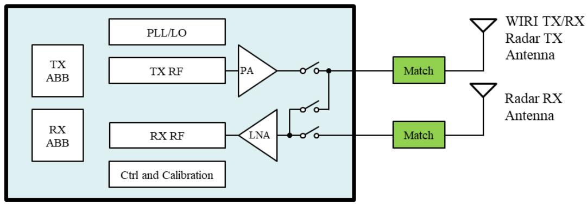
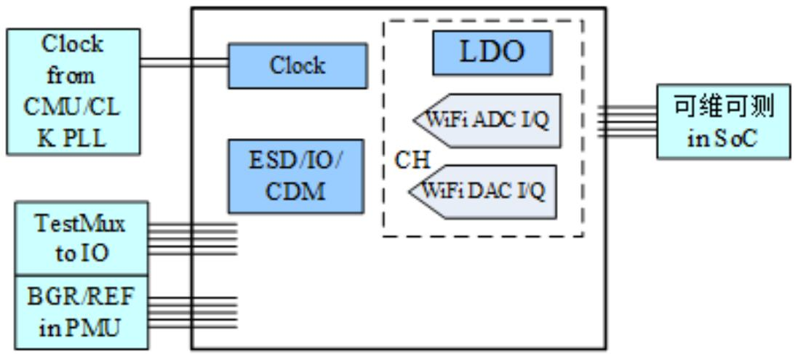

(ch4-wifi)=

# WiFi /BLE & SLE 系统

4.1 WiFi / BLE & SLE RF 

4.2 WiFi/BLE & SLE ABB 

4.3 WiFi PHY 

4.4 WiFi MAC 

4.5 BLE/SLE 

4.6 雷达特性 

## 4.1 WiFi / BLE & SLE RF

### 4.1.1 概述

RF 部分包含 2.4G RX、TX、PLL 三个模块。支持 IEEE 802.11b/g/n/ax 20M 模式。 RF 的电路功能主要包含： 

集成 TX/RX Switch。 

RX 通路包含 LNA、Mixer、LPF（Low Pass Filter）、VGA（Variable Gain Amplifier）。 

TX 通路包含 LPF、UPC（UP Converter）、PA（Power Amplifier）。 

集成 PLL/LO（Local Oscillator）通路，为信号通路提供 LO。 

集成了 Radar 功能 


图4-1 RF 电路模块架构





### 4.1.2 功能描述

WiFi RF 具有以下功能特点： 

RF 电路提供稳定的 LO 信号，支持收发信号的上下变频功能。 

支持校准功能，包含：RX DC（Direct Current）校准、TX LO Leakage 校准、 TX Power 校准、TRX IQ 校准等。 

### 4.1.3 RF 性能

芯片集成 2.4G WiFi/BLE/SLE 收发机，支持雷达功能。除雷达在 RFI口接收之外，其 他的功能都在 RFIO 口测试。 

```{list-table}
:header-rows: 1
:class: longtable

* - 参数
  - Sub-Item
  - 最小值
  - 典型值
  - 最大值
  - 单位
  - 测试条件
* - RF 工作频率段
  - -
  - 2400
  - -
  - 2500
  - MHz
  - 2401MHz 以下和2483.5MHz 以上频点无法满足无委会辐射要求。信道频率的选择需要遵循协议和法规要求。
* - **WIF RX 11b 灵敏度**
  - 
  - 
  - 
  - 
  - 
  - 
* - 1 MbpsDSSS
  - -
  - -99
  - -98
  - dBm
  - 
  - 
* - 2 MbpsDSSS
  - -
  - -96
  - -95
  - dBm
  - 
  - 
* - 5.5 Mbps DSSS/CCK
  - -
  - -94
  - -93
  - dBm
  - 
  - 
* - 11 Mbps DSSS/CCK
  - -
  - -91
  - -90
  - dBm
  - 
  - 
* - **WIF RX 11g 灵敏度**
  - 
  - 
  - 
  - 
  - 
  - 
* - BPSK, R=1/2 (6Mbps OFDM)
  - -
  - -96
  - -95
  - dBm
  - 
  - 
* - BPSK, R=3/4 (9Mbps OFDM)
  - -
  - -94
  - -92
  - dBm
  - 
  - 
* - QPSK, R=1/2 (12Mbps OFDM)
  - -
  - -93
  - -91
  - dBm
  - 
  - 
* - QPSK, R=3/4 (18Mbps OFDM)
  - -
  - -90
  - -89
  - dBm
  - 
  - 
* - 16-QAM, R=1/2 (24Mbps OFDM)
  - -
  - -87
  - -86
  - dBm
  - 
  - 
* - 16-QAM, R=3/4 (36Mbps OFDM)
  - -
  - -84
  - -82
  - dBm
  - 
  - 
* - 16-QAM, R=1/2 (48Mbps OFDM)
  - -
  - -80
  - -78
  - dBm
  - 
  - 
* - 64-QAM, R=3/4 (54Mbps OFDM)
  - -
  - -78
  - -76
  - dBm
  - 
  - 
* - **WIF RX 11n HT20-MF 灵敏度**
  - 
  - 
  - 
  - 
  - 
  - 
* - HT20 MCS0
  - -
  - -95
  - -94
  - dBm
  - BCC Long PER 10%, 4096
  - 
* - HT20MCS1
  - -
  - -92
  - -91
  - dBm
  - 
  - 
* - HT20MCS2
  - -
  - -90
  - -88
  - dBm
  - 
  - 
* - HT20MCS3
  - -
  - -87
  - -85
  - dBm
  - 
  - 
* - HT20MCS4
  - -
  - -83
  - -82
  - dBm
  - 
  - 
* - HT20MCS5
  - -
  - -79
  - -78
  - dBm
  - 
  - 
* - HT20MCS6
  - -
  - -77
  - -75
  - dBm
  - 
  - 
* - HT20MCS7
  - -
  - -76
  - -74
  - dBm
  - 
  - 
* - **WIF RX 11n HT40-MF 灵敏度**
  - 
  - 
  - 
  - 
  - 
  - 
* - HT40MCS0
  - -
  - -93
  - -92
  - dBm
  - 
  - 
* - HT40MCS1
  - -
  - -90
  - -88
  - dBm
  - 
  - 
* - HT40MCS2
  - -
  - -87
  - -86
  - dBm
  - 
  - 
* - HT40MCS3
  - -
  - -84
  - -83
  - dBm
  - 
  - 
* - HT40MCS4
  - -
  - -81
  - -79
  - dBm
  - 
  - 
* - HT40MCS5
  - -
  - -76
  - -75
  - dBm
  - 
  - 
* - HT40MCS6
  - -
  - -74
  - -73
  - dBm
  - 
  - 
* - HT40MCS7
  - -
  - -73
  - -72
  - dBm
  - 
  - 
* - **WIF RX 11ax HE20 灵敏度**
  - 
  - 
  - 
  - 
  - 
  - 
* - HE20MCS0
  - -
  - -96
  - -95
  - dBm
  - 
  - 
* - HE20MCS1
  - -
  - -93
  - -92
  - dBm
  - 
  - 
* - HE20MCS2
  - -
  - -91
  - -89
  - dBm
  - 
  - 
* - HE20 MCS3
  - -
  - -88
  - -87
  - dBm
  - 
  - 
* - HE20 MCS4
  - -
  - -84
  - -83
  - dBm
  - 
  - 
* - HE20 MCS5
  - -
  - -80
  - -79
  - dBm
  - 
  - 
* - HE20 MCS6
  - -
  - -79
  - -77
  - dBm
  - 
  - 
* - HE20 MCS7
  - -
  - -77
  - -75
  - dBm
  - 
  - 
* - HE20 MCS8
  - -
  - -73
  - -72
  - dBm
  - 
  - 
* - HE20 MCS9
  - -
  - -71
  - -70
  - dBm
  - 
  - 
* - **WIFI RX 11b 最大解调电平**
  - 
  - 
  - 
  - 
  - 
  - 
* - 1 Mbps DSSS
  - -
  - 0
  - -
  - dBm
  - 
  - 
* - 2 Mbps DSSS
  - -
  - 0
  - -
  - dBm
  - 
  - 
* - 5.5 Mbps DSSS/CCK
  - -
  - 0
  - -
  - dBm
  - 
  - 
* - 11 Mbps DSSS/CCK
  - -
  - 0
  - -
  - dBm
  - 
  - 
* - WIFI RX 11g 最大解调电平
  - 64-QAM, R=3/4 (54Mbps OFDM)
  - -
  - 0
  - -
  - dBm
  - PER 8%, 1000 octets PPDU
* - WIFI RX 11n HT20 最大解调电平
  - HT20 MCS7
  - -
  - 0
  - -
  - dBm
  - PER 10%, 4096 octets PPDU
* - **WIFI RX 11b 邻道抑制比**
  - 
  - 
  - 
  - 
  - 
  - 
* - 1Mbps DSSS
  - -
  - 48
  - -
  - dB
  - 有用信号-74dBm, PER 8%, 1024 octets PPDU
  - 
* - 2Mbps DSSS
  - -
  - 59
  - -
  - dB
  - 有用信号-74dBm, PER 8%, 1024 octets PPDU
  - 
* - 5.5Mbps DSSS/CCK
  - -
  - 44
  - -
  - dB
  - 有用信号-70dBm, PER 8%, 1024 octets PPDU
  - 
* - 11Mbps DSSS/CCK
  - -
  - 44
  - -
  - dB
  - 有用信号-70dBm, PER 8%, 1024 octets PPDU
  - 
* - **WIFI RX 11g 邻道抑制比**
  - 
  - 
  - 
  - 
  - 
  - 
* - BPSK, R=1/2 (6Mbps OFDM)
  - -
  - 34
  - -
  - dB
  - 有用信号-79dBm, PER 8%, 1000 octets PPDU
  - 
* - BPSK, R=3/4 (9Mbps OFDM)
  - -
  - 30
  - -
  - dB
  - 有用信号-78dBm, PER 8%, 1000 octets PPDU
  - 
* - QPSK, R=1/2 (12Mbps OFDM)
  - -
  - 31
  - -
  - dB
  - 有用信号-76dBm, PER 8%, 1000 octets PPDU
  - 
* - QPSK, R=3/4 (18Mbps OFDM)
  - -
  - 27
  - -
  - dB
  - 有用信号-74dBm, PER 8%, 1000 octets PPDU
  - 
* - 16-QAM, R=1/2 (24Mbps OFDM)
  - -
  - 27
  - -
  - dB
  - 有用信号-71dBm, PER 8%, 1000 octets PPDU
  - 
* - 16-QAM, R=3/4 (36Mbps OFDM)
  - -
  - 22
  - -
  - dB
  - 有用信号-67dBm, PER 8%, 1000 octets PPDU
  - 
* - 16-QAM, R=1/2 (48Mbps OFDM)
  - -
  - 19
  - -
  - dB
  - 有用信号-63dBm, PER 8%, 1000 octets PPDU
  - 
* - 64-QAM, R=3/4 (54Mbps OFDM)
  - -
  - 20
  - -
  - dB
  - 有用信号-62dBm, PER 8%, 1000 octets PPDU
  - 
* - **WIFI RX 11n HT20 邻道抑制比**
  - 
  - 
  - 
  - 
  - 
  - 
* - HT20MCS0
  - -
  - 30
  - -
  - dB
  - 有用信号-79dBm,PER 10%, 4096octets PPDU
  - 
* - HT20MCS1
  - -
  - 29
  - -
  - dB
  - 有用信号-76dBm,PER 10%, 4096octets PPDU
  - 
* - HT20MCS2
  - -
  - 26
  - -
  - dB
  - 有用信号-74dBm,PER 10%, 4096octets PPDU
  - 
* - HT20MCS3
  - -
  - 24
  - -
  - dB
  - 有用信号-71dBm,PER 10%, 4096octets PPDU
  - 
* - HT20MCS4
  - -
  - 19
  - -
  - dB
  - 有用信号-67dBm,PER 10%, 4096octets PPDU
  - 
* - HT20MCS5
  - -
  - 17
  - -
  - dB
  - 有用信号-63dBm,PER 10%, 4096octets PPDU
  - 
* - HT20MCS6
  - -
  - 15
  - -
  - dB
  - 有用信号-62dBm,PER 10%, 4096octets PPDU
  - 
* - HT20MCS7
  - -
  - 13
  - -
  - dB
  - 有用信号-61dBm,PER 10%, 4096octets PPDU
  - 
* - **WIFI RX 11n HT40 邻道抑制比**
  - 
  - 
  - 
  - 
  - 
  - 
* - HT40MCS0
  - -
  - 29
  - -
  - dB
  - 有用信号-76dBm,PER 10%, 4096octets PPDU
  - 
* - HT40MCS1
  - -
  - 27
  - -
  - dB
  - 有用信号-73dBm,PER 10%, 4096octets PPDU
  - 
* - HT40MCS2
  - -
  - 24
  - -
  - dB
  - 有用信号-71dBm,PER 10%, 4096octets PPDU
  - 
* - HT40MCS3
  - -
  - 21
  - -
  - dB
  - 有用信号-68dBm,PER 10%, 4096octets PPDU
  - 
* - HT40 MCS4
  - -
  - 17
  - -
  - dB
  - 有用信号-64dBm, PER 10%, 4096 octets PPDU
  - 
* - HT40 MCS5
  - -
  - 13
  - -
  - dB
  - 有用信号-60dBm, PER 10%, 4096 octets PPDU
  - 
* - HT40 MCS6
  - -
  - 14
  - -
  - dB
  - 有用信号-59dBm, PER 10%, 4096 octets PPDU
  - 
* - HT40 MCS7
  - -
  - 10
  - -
  - dB
  - 有用信号-58dBm, PER 10%, 4096 octets PPDU
  - 
* - **WIFI TX 11b 最大发射功率**
  - 
  - 
  - 
  - 
  - 
  - 
* - 1Mbps DSSS
  - -
  - 23
  - -
  - dBm
  - 
  - 
* - 2Mbps DSSS
  - -
  - 23
  - -
  - dBm
  - 
  - 
* - 5.5Mbps DSSS/CCK
  - -
  - 23
  - -
  - dBm
  - 
  - 
* - 11Mbps DSSS/CCK
  - -
  - 23
  - -
  - dBm
  - 
  - 
* - **WIFI TX 11g 最大发射功率**
  - 
  - 
  - 
  - 
  - 
  - 
* - BPSK, R=1/2 (6Mbps OFDM)
  - -
  - 21
  - -
  - dBm
  - 
  - 
* - BPSK, R=3/4 (9Mbps OFDM)
  - -
  - 21
  - -
  - dBm
  - 
  - 
* - QPSK, R=1/2 (12Mbps OFDM)
  - -
  - 21
  - -
  - dBm
  - 
  - 
* - QPSK, R=3/4 (18Mbps OFDM)
  - -
  - 21
  - -
  - dBm
  - 
  - 
* - 16-QAM, R=1/2 (24Mbps OFDM)
  - -
  - 21
  - -
  - dBm
  - 
  - 
* - 16-QAM, R=3/4 (36Mbps OFDM)
  - -
  - 21
  - -
  - dBm
  - 
  - 
* - 16-QAM, R=1/2 (48Mbps OFDM)
  - -
  - 20
  - -
  - dBm
  - 
  - 
* - 64-QAM, R=3/4 (54Mbps OFDM)
  - -
  - 19
  - -
  - dBm
  - 
  - 
* - **WIFI TX HT20-MF 最大发射功率**
  - 
  - 
  - 
  - 
  - 
  - 
* - MCS0
  - -
  - 20
  - -
  - dBm
  - 
  - 
* - MCS1
  - -
  - 20
  - -
  - dBm
  - 
  - 
* - MCS2
  - -
  - 20
  - -
  - dBm
  - 
  - 
* - MCS3
  - -
  - 19
  - -
  - dBm
  - 
  - 
* - MCS4
  - -
  - 19
  - -
  - dBm
  - 
  - 
* - MCS5
  - -
  - 19
  - -
  - dBm
  - 
  - 
* - MCS6
  - -
  - 19
  - -
  - dBm
  - 
  - 
* - MCS7
  - -
  - 18
  - -
  - dBm
  - 
  - 
* - **WIFI TX HT40-MF 最大发射功率**
  - 
  - 
  - 
  - 
  - 
  - 
* - MCS0
  - -
  - 20
  - -
  - dBm
  - 
  - 
* - MCS1
  - -
  - 20
  - -
  - dBm
  - 
  - 
* - MCS2
  - -
  - 20
  - -
  - dBm
  - 
  - 
* - MCS3
  - -
  - 19
  - -
  - dBm
  - 
  - 
* - MCS4
  - -
  - 19
  - -
  - dBm
  - 
  - 
* - **HE20 最大发射功率**
  - 
  - 
  - 
  - 
  - 
  - 
* - MCS1
  - -
  - 20
  - -
  - dBm
  - 
  - 
* - MCS2
  - -
  - 20
  - -
  - dBm
  - 
  - 
* - MCS3
  - -
  - 19
  - -
  - dBm
  - 
  - 
* - MCS4
  - -
  - 19
  - -
  - dBm
  - 
  - 
* - MCS5
  - -
  - 19
  - -
  - dBm
  - 
  - 
* - MCS6
  - -
  - 19
  - -
  - dBm
  - 
  - 
* - MCS7
  - -
  - 18
  - -
  - dBm
  - 
  - 
* - MCS8
  - -
  - 17
  - -
  - dBm
  - 
  - 
* - MCS9
  - -
  - 15
  - -
  - dBm
  - 
  - 
* - **LE RX 灵敏度**
  - 
  - 
  - 
  - 
  - 
  - 
* - LE 1M
  - -
  - -99
  - -98
  - dBm
  - 
  - 
* - LE 2M
  - -
  - -96
  - -95
  - dBm
  - 
  - 
* - LR S2 255byte
  - -
  - -100
  - -99
  - dBm
  - 
  - 
* - LR S8 255byte
  - -
  - -105
  - -103
  - dBm
  - 
  - 
* - LR S2 37byte
  - -
  - -101
  - -100
  - dBm
  - 
  - 
* - LR S8 37byte
  - -
  - -105
  - -104
  - dBm
  - 
  - 
* - **SLE RX 灵敏度**
  - 
  - 
  - 
  - 
  - 
  - 
* - SLE_1M GFSK
  - -
  - -99
  - -97
  - dBm
  - 
  - 
* - SLE_2M GFSK
  - -
  - -96
  - -94
  - dBm
  - 
  - 
* - SLE_4M GFSK
  - -
  - -93
  - -91
  - dBm
  - 
  - 
* - 1M QPSK shortHD pilot16:1 polar3/4
  - -
  - -101
  - -100
  - dBm
  - 
  - 
* - 2M QPSK shortHD pilot16:1 polar3/4
  - -
  - -98
  - -96
  - dBm
  - 
  - 
* - 4M QPSK shortHDpilot16:1polar3/4
  - -
  - -95
  - -93
  - dBm
  - 
  - 
* - 1M 8PSKshortHDPilot16:1polar3/4
  - -
  - -96
  - -94
  - dBm
  - 
  - 
* - 2M 8PSKshortHDPilot16:1polar3/4
  - -
  - -93
  - -91
  - dBm
  - 
  - 
* - 4M 8PSKshortHDPilot16:1polar3/4
  - -
  - -90
  - -88
  - dBm
  - 
  - 
* - 1M QPSKshortHDPilot_nopolar1/1
  - -
  - -96
  - -94
  - dBm
  - 
  - 
* - 2M QPSKshortHDPilot_nopolar1/1
  - -
  - -93
  - -92
  - dBm
  - 
  - 
* - 4M QPSKshortHDPilot_nopolar1/1
  - -
  - -89
  - -88
  - dBm
  - 
  - 
* - 1M 8PSKshortHDPilot_nopolar1/1
  - -
  - -90
  - -88
  - dBm
  - 
  - 
* - 2M 8PSKshortHDPilot_nopolar1/1
  - -
  - -87
  - -86
  - dBm
  - 
  - 
* - 4M 8PSKshortHDPilot_nopolar1/1
  - -
  - -82
  - -81
  - dBm
  - 
  - 
* - **LE TX 最大发射功率**
  - 
  - 
  - 
  - 
  - 
  - 
* - LE 1M
  - -
  - 20
  - -
  - dBm
  - 
  - 
* - LE 2M
  - -
  - 20
  - -
  - dBm
  - 
  - 
* - LR S2500K
  - -
  - 20
  - -
  - dBm
  - 
  - 
* - 
  - LR S8125K
  - -
  - 20
  - -
  - dBm
  - 
* - **SLE TX 最大发射功率**
  - 
  - 
  - 
  - 
  - 
  - 
* - SLE_1MGFSK
  - -
  - 20
  - -
  - dBm
  - 
  - 
* - SLE_2MGFSK
  - -
  - 20
  - -
  - dBm
  - 
  - 
* - SLE_4MGFSK
  - -
  - 20
  - -
  - dBm
  - 
  - 
* - 1M QPSKshortHDPilot16:1polar3/4
  - -
  - 14
  - -
  - dBm
  - 
  - 
* - 2M QPSKshortHDPilot16:1polar3/4
  - -
  - 14
  - -
  - dBm
  - 
  - 
* - 4M QPSKshortHDPilot16:1polar3/4
  - -
  - 14
  - -
  - dBm
  - 
  - 
* - 1M 8PSKshortHDPilot16:1polar3/4
  - -
  - 14
  - -
  - dBm
  - 
  - 
* - 2M 8PSKshortHDPilot16:1polar3/4
  - -
  - 14
  - -
  - dBm
  - 
  - 
* - 4M 8PSKshortHDPilot16:1polar3/4
  - -
  - 14
  - -
  - dBm
  - 
  - 
* - 1M QPSKshortHDPilot_no polar1/1
  - -
  - 14
  - -
  - dBm
  - 
  - 
* - 2M QPSKshortHDPilot_nopolar1/1
  - -
  - 14
  - -
  - dBm
  - 
  - 
* - 4M QPSK shortHD pilot_no polar1/1
  - -
  - 14
  - -
  - dBm
  - 
  - 
* - 1M 8PSK shortHD pilot_no polar1/1
  - -
  - 14
  - -
  - dBm
  - 
  - 
* - 2M 8PSK shortHD pilot_no polar1/1
  - -
  - 14
  - -
  - dBm
  - 
  - 
* - 4M 8PSK shortHD pilot_no polar1/1
  - -
  - 14
  - -
  - dBm
  - 
  - 
* - TX 输出功率精度
  - -
  - -2
  - -
  - 2
  - dB
  - -
* - TX 输出功率分辨率
  - -
  - -
  - 1
  - -
  - dB
  - BT 只能发送固定功率
```

### 说明

以上数据仿真条件为 VBAT=3.3V。 

## 4.2 WiFi/BLE & SLE ABB

### 4.2.1 概述

ABB IP 用于 Connectivity SoC 芯片，是支持 WiFi 802.11b/g/n/ax（2.4G mode）系统 的模拟数字接口模块，根据功能分为以下 2 个功能模块： 

WiFi IQ-ADC 

WiFi IQ DAC 

完成发送时的数模转换及接收时的模数转换功能。 

WiFi ADC（1 个通道，通道有 IQ）、WiFi DAC（1 个通道，通道有 IQ），以及时钟 buf 模块和 LDO，共同包括在 Q353333N1100 WL ABB 中，时钟 buf 和 LDO 不作为独立 功能模块，不在行为模型中独立体现。 


图4-2 ABB 模块组成





注：WADC（WiFi Analog Digital Converter），WDAC（WiFi Digital Analog Converter）。


### 4.2.2 功能描述

ABB IP 具有以下功能特点： 

提供 1 路 WiFi IQ ADC、1 路 WiFi IQ DAC。 

支持 WiFi 802.11b/g/n（2.4G mode）。 

### 4.2.3 工作方式

业务模式寄存器配置为固定一次性配置，业务工作期间无需重复配置，仅在逻辑电源 掉电重新上电时需要重新配置；校正算法在温度、电压漂移下受影响，如果温度、电 压变化较大，需要重新运行算法并刷新寄存器，除此情况之外无需重复配置。 

校准包括： 

WLAN（Wireless Local Area Network）的 ADC 比较器校准。 

WLAN DC Offset 校准。 

WLAN 电容校准。 

校准步骤： 

步骤 1 比较器校准。 

步骤 2 电容校准。 

步骤 3 DC Offset 校准。 

 

## 4.3 WiFi PHY

### 4.3.1 概述

WLAN PHY 实现 802.11 协议定义的物理层功能，包括： 

802.11b 协议定义的 DSSS、CCK 调制解调。 

802.11g、802.11n、802.11ax 协议定义的 OFDM 调制解调包括发送的加扰、交 织、编码、OFDM 调制等处理；接收方向 OFDM 解调、Viterbi 译码、解交织、解 扰等处理；同时实现 AGC（Automatic Gain Control）、CCA（Clear Channel Assessment）、RSSI(Receive Signal Strength Indicator)功能。 

实现 RF/ABB 校准功能。 

### 4.3.2 功能描述

WiFi PHY 具有以下功能特点： 

支持 IEEE802.11b/g/n/ax 无线局域网络通信协议，其中 ax 支持 su/ersu 的收发、 tb 帧的发送、mu 帧的接收。 

支持 802.11b 的 DSSS、CCK，802.11g/n/ax 的 BCC(Binary Convolutional Code) 编解码，802.11n/ax 的 LDPC(Low Density Parity Check)的编码。 

支持 2.4G Band， 802.11b/g/n/ax 支持 20MHz 信号带宽， 802.11n 支持 40MHz 信号带宽， 802.11ax（tb/mu）支持 20MHz-only 信号带宽。 

支持 4 选 1 多天线分集，最大支持 1 个空间流；802.11n/ax 支持 STBC(Space-Time Block Code)接收; 802.11n/ax 支持 4x1 TxBF； 802.11ax 最多支持 4 用 户识别并支持配置其中任一个用户接收。 

支持雷达感知(Radar Sensing)。 

支持 GLP(Green-tooth Low-energy Positioning)辅助同步。 

支持 PSD(Power Spectral Desity)上报。 

支持 CSI(Channel State Infomation)上报。 

支持 ABB/RF 校准功能。 

### 4.3.3 工作方式

PHY 模式初始化配置支持物理带宽为 20MHz 的 WiFi 业务收发，在业务模式下可以根 据与 AP 的交互完成不同物理带宽的切换，也可以再测试模式下配置不同的物理带宽 用于性能测试或者问题定位。PHY 会根据不同的带宽，自适应驱动配置，完成基带数 据发送或者接收。根据上层业务的需求，PHY 主要支持以下几种工作模式。 

### 校准模式

在上电时对 ABB/RF 进行离线校准，RF 配置校准模式，复用 PHY 中部分逻辑通路进 行校准计算，校准项主要包括 TXDC、TXIQ、TXPWR、RXDC、RXIQ、RXRC 等， 校准完成后将校准结果存储在 PHY 中对应配置寄存器中，在测试或者业务模式下自动 线控调用，优化 ABB/RF 性能。 

### 测试模式

测试模式，主要是常发、常收测试。其中常发测试主要是指基于描述符后来者配置寄 存器下发 TXVECTOR 来启动 RF 线控及 PHY 内部编码调制等，最终将数字 DAC 数 据送给 ABB/RF 输出，多帧连续输出，配合仪器用于测试发送时各种性能指标或者基 本问题定位；常收测试主要将进过 ABB/RF 的数字 ADC 数据送给 PHY进行解调，并 将解调后的数据送给 MAC 进行 FCS(Frame Check Sequence)校验，来统计接收数据 的是否正确，多帧连续输入，配合仪器用于测试接收时各种性能指标或者基本问题定 位。 

### 业务模式

业务模式下，PHY 受上层 MAC 主控，与 AP 进行收发通信。业务发送时，PHY 接收 来自 MAC 的 TXVECTOR，启动 RF 线控及 PHY 编码调制等，最终将数字 DAC 送给 ABB/RF 数采。业务接收时，PHY 将来自 ABB/RF 的数字 ADC 数据经过 AGC 控制后 进行解调译码，并将解析后数据送给上层 MAC 进一步处理。 

### 雷达感知模式

雷达感知模式下，PHY受上层 MAC 主控，根据业务需求启动雷达感知使能，PHY会 从 PKTRAM 中读取 DAC 采样率下的雷达数据，经过校准后送给 ABB/RF；同时会将 经过 ABB/RF 的数字 ADC 数据经过固定增益控制后的 ADC 数据进行校准处理，然后 校准后的 ADC 数据储存在 PKTRAM 中，并给出中断信息，CPU 收到中断信息后对存 储在 PKTRAM 中的雷达数据做进一步处理，满足雷达感知业务需求。 

#### PSD 模式

PSD 模式下，PHY将来自 ABB/RF 的数字 ADC 数据经过 AGC 控制后进行 FFT 计算 等统计，最终将 PSD 存储在内部存储空间，并以中断形式上报 CPU，CPU 收到中断 后顺序将 PSD 信息读出。可以通过配置不同信道多次统计，收集数据用于再次开发利 用。 

#### GLP 联合测距模式

支持与 GLP 联合测距，WiFi 业务下生成发送/接收初始化同步脉冲，给 GLP 提供精确 的脉冲定时以及频偏估计值上报。 

## 4.4 WiFi MAC

### 4.4.1 概述

DBB（Digital Baseband） MAC 主要完成 WiFi MAC 层的硬件处理，包括信道接入、 组解帧、数据收发、加解密、节能控制等功能。 

### 4.4.2 功能描述

WiFi MAC 具有以下功能特点： 

支持 IEEE802.11b/g/n/ax 无线局域网络通信协议。 

支持 STA 模式和 AP 模式。 

支持 2.4G Band、802.11b/a/g 20MHz；802.11n 20MHz/40MHz；802.11ax 20MHz。最大支持 1 流、1 天线。 

支持 WPA、WPA2、AES 加解密。 

支持 WPS2.0。 

支持协议低功耗：PSM（Power Saving Mode）、UAPSD（Unscheduled Automatic Power Save Delivery）、P2P（Peer-to-Peer） Power Save。 

### 4.4.3 工作方式

### 4.4.3.1 AP 模式

在一个基础 BSS（Basic Service Set）网络中提供所有接入点的基本功能，包括： 

发送 Beacon 帧声明 BSS 的存在和能力。 

为 BSS 中的客户端提供无线关联和认证服务。 

管理 BSS 网络中与之关联的客户端。 

芯片支持 1 个 AP。 

### 4.4.3.2 STA 模式

在一个基础 BSS 网络中提供扫描发现网络、加入网络并管理与 AP 的连接以提供数据 收发服务的功能。 

芯片支持 2 个 STA。 

### 4.4.3.3 Monitor 模式

芯片进入 Monitor 模式，实现网卡的功能，MAC 将接收到的所有帧上报软件。 

### 4.4.3.4 AP 与 STA 共存

芯片支持 1 个 AP 和 1 个 STA 同时工作。 

芯片支持 2.4G 下 AP/STA 在相同或不同信道的并发，分别对应同频共存和异频共存。 

约束：STA 上电后会进行信道扫描，导致信道切换，因此开启 AP/STA 动态共存时， 需要先创建 STA，再创建 AP，否则将会影响 AP 的工作信道。 

### 4.4.3.5 CSI 模式

CSI（Channel State Information）模式支持将 PHY 上报的信道状态信息（CSI）过滤 后上报软件： 

支持 11g/11n/11ax 的 CSI 信息上报，不支持 11b。 

支持对将提取 CSI 的帧进行源地址过滤，源地址过滤列表（白名单）共 6 个（关 联设备使用 LUT（Lookup Table）中的地址内容）。 

支持 6 个 CSI 采样周期，CSI 采样周期与白名单绑定，一个白名单对应一个采集 周期。 

 支持白名单、采样周期、特定帧类型等匹配条件，满足匹配条件才上报 CSI 信 息。 

支持带宽（20MHz、40MHz）、帧格式（NON-HT、HT-MF）、RSSI（Received Signal Strength Indicator）、SNR（Signal Noise Ratio）随 CSI 信息上报（不支 持 STBC 帧上报），上报 L-LTF H 矩阵数据。 

## 4.5 BLE/SLE

### 4.5.1 概述

BLE/SLE 部分包含 MODEM 和 MAC，MODEM 实现调制解调功能，MAC 部分实现调 度、收发控制和组包解包功能。 

### 4.5.2 功能描述

BLE 主要特性如表 4-1 所示。 


表4-1 BLE 主要特性


```{list-table}
:header-rows: 1
:class: longtable

* - 标题
  - 描述
* - 蓝牙协议版本
  - 支持蓝牙核心规范 5.4。
* - 蓝牙模式
  - 仅支持 Low Energy only。
* - BT4.0 特性
  - 支持蓝牙规范 4.0 特性。
* - Low Energy Physical
  - Low Energy Physical Layer。
* - Low Energy Link
  - Low Energy Link Layer。
* - Enhancements to HCI for Low Energy
  - 支持 BLE 模式相关的 HCI 功能。
* - Low Energy Direct Test Mode
  - 支持 BLE 直接测试模式。
* - AES Encryption
  - 支持对数据包进行 AES 加解密。
* - BT4.1 特性
  - 支持蓝牙规范 4.1 特性。
* - Low duty cycle directed advertising
  - 支持低占空比定向广播。
* - LE Dual mode topology
  - BLE 设备可同时为 master 和 Slave。
* - Fast Advertising interval
  - 支持高占空比定向广播。
* - LE privacy v1.1
  - 支持 LE 隐私策略 v1.1。
* - LE Ping
  - 支持 LE Ping 功能。
* - Private address changes
  - 支持私有地址变更功能。
* - BT4.2 特性
  - 支持蓝牙规范 4.2 特性。
* - LE Data Packet Length Extension
  - 支持数据包长度扩展,最大可支持 250Byte。
* - LE Secure Connections
  - 支持低功耗蓝牙安全连接。
* - Link Layer privacy
  - 支持低功耗蓝牙链路层隐私策略。
* - Link Layer Extended Scanner Filter policies
  - 支持扩展扫描过滤机制。
* - BT5.0 特性
  - 支持蓝牙规范 5.0 特性。
* - 2 Msym/s PHY for LE
  - 支持 2M 传输速率。
* - LE Channel Selection Algorithm #2
  - 支持自适应跳频算法 2。
* - High Duty Cycle Non-Connectable Advertising
  - 支持高占空比非连接广播。
* - LE Long Range
  - 支持 BLE Long Range。
* - BT5.2 特性
  - 支持蓝牙规范 5.2 特性。
* - BLE Power Control
  - 支持功率控制功能。
* - 连接个数
  - 支持 4 条 BLE 连接(可选 8 条)。
* - BLE dual mode
  - BLE 设备支持的角色。
* - Master
  - 支持 LE 的 Master role。
* - Slave
  - 支持 LE 的 Slave Role。
* - PHY Update
  - 支持选择 PHY 信道。
* - Data Length Update
  - 支持选择数据包的长度。
* - 白名单个数
  - 白名单个数最大支持 8 条。
* - BLE RPA 列表
  - Device 能支持的最大的 BLE RPA 名单数目到 4 个。
* - RPA 功能
  - 支持私有可解析地址功能。广播、扫描、Init 支持 RPA 功能。
* - RPA 名单个数
  - 最大支持 4 条 RPA 条目。
* - 快速信道干扰检测
  - 支持业务间隙扫描蓝牙信道所有频点,以判断空口的干扰程度。
* - Channel map update
  - 支持信道位图更新功能。
* - 信道扫描
  - 支持扫描所有的蓝牙信道,根据扫描结果评估信道干扰程度。
```

SLE 主要特性如表 4-2 所示。 


表4-2 SLE 主要特性


```{list-table}
:header-rows: 1
:class: longtable

* - 标题
  - 描述
* - SLE 协议 1.0
  - 支持 SLE1.0 协议核心规范内容。
* - SLE 链路管理
  - 支持 SLE 链路管理。
* - 时隙调度
  - 支持系统基础时隙按 125μs 调度。
* - SLE 广播业务
  - 支持 SLE 广播链路业务。
* - Channel Scan 业务
  - 支持对通信信道进行扫描,上报信道 rssi。
* - SLE 帧格式
  - 支持 SLE1.0 协议无线帧类型。支持 SLE1.0 协议无线帧类型 1。支持 SLE1.0 协议无线帧类型 2。
* - 白名单个数
  - 白名单个数最大支持 8 条。
* - SLE 调制模式和物理层带宽
  - 支持调制解调带宽 1M/2M/4M 三种速率。支持 SLE 调制方式 GFSK-1M/GFSK-2M/GFSK-4M 三种速率。支持 QPSK 调制方式 QPSK-1M/QPSK-2M/QPSK-4M 三种速率。支持 8PSK 调制方式 8PSK-1M/8PSK-2M/8PSK-4M 三种速率。
* - SLE 码率
  - 支持帧类型 2 下,QPSK 调制 Polar 码率为 3/4。支持帧类型 2 下,8PSK 调制 Polar 码率为 3/4、1。
* - SLE 导频插值比例
  - 支持帧类型 2 下,数据信息符号导频比为 4:1、16:1。
* - 信道干扰检测
  - 支持信道扫描业务进行干扰检测。
* - 连接个数
  - 支持默认最大支持 4 条 SLE link(可选 8 条,与 BLE 共享连接数)。
```

### 4.5.3 工作方式

### 4.5.3.1 中断

BLE&SLE CPU 只有 2 个主中断源 ble_irq/SLE_irq，每个中断源由多个子中断源汇和 而成，CPU 响应相应中断源，通过查询中断状态寄存器来查询子中断类型。 

### 4.5.3.2 加密

BLE 支持 AES-128 加密方式，SLE 支持 SM4 和 AES-128 加密。 

## 4.6 雷达特性

### 4.6.1 概述

雷达模块通过芯片内置的雷达信号发送、接收以及信号处理模块，实现近距离的运动 人体感知功能。 

### 4.6.2 功能描述

芯片可同时提供“靠近检测”和“存在检测”两种感知能力 

### 4.6.2.1 靠近检测

### 须知

指标是在公版模组上测试得到，在其他自研模组上，天线设计需要满足天线隔离度、 天线方向性和天线增益等要求，否则性能会受到影响。 

可以检测距离芯片 2.5m 范围内运动人体，并分[0, 1.5m]、[1.5m, 2.5m]两档上报，上 报延时＜1s，准确率＞99% 

### 4.6.2.2 存在检测

### 须知

1. 上述指标是在公版模组上测试得到，在其他自研模组上，天线设计需要满足天线隔 离度、天线方向性和天线增益等要求，否则性能会受到影响 

2. 芯片提供一定抗非人体干扰能力，比如晃动的绿植、风吹窗帘等，但是要占用额外 的内存和算力，识别延时＜5s，准确率＞95%。 

可以检测距离芯片 6m 内是否存在运动人体，上报延时＜2s，准确率＞99%。 

### 4.6.3 工作方式

雷达模块与 WIFI 业务之间通过分时共存，雷达信号本身有如下特点： 

雷达信号间隔 5ms。 

雷达信号占空比＜2%。 

最快每 0.32s 上报一次检测结果。